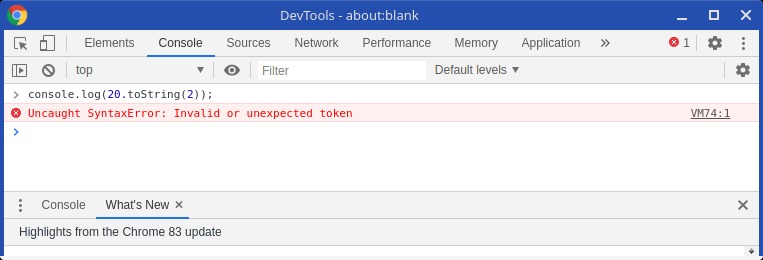
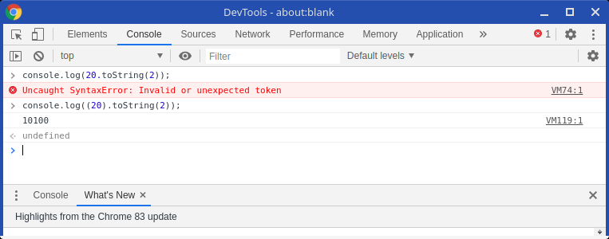

I don't know if you are aware, but javascript literal numbers have properties, the same way strings. Take this example:

```js
const x = 20;
console.log(x.toString(2));
```

This example converts the number 20 to its binary representation and prints to the console. That's nice, but what if I tried to write a shorter version:

```js
console.log(20.toString(2));
```

If you try to run this line of code, you will get an message error



The interesting thing is that if we enclose the number between parenthesis, it works as intended



So you may be wondering why the compiler throws an error in the previous example. 
The answer is simple, the dot "." before "toString" is being interpreted as a being the decimal separator.

We can clearly see that by adding a simple space between the number and ".toString", 
since, accordingly to javascript syntax, the dot decimal separator has to be right after the number,
so the compiler eliminates this possibility and concludes that the dot means property access.

```js
console.log(20 .toString(2));
```

I think relying on spaces for syntax, at least in javascript, is somewhat dangerous, someone can come later and remove the "not aesthetically pleasing" space, adding an error.

I would prefer it like this instead:

```js
console.log(20..toString(2));
```

Anyways, this is not a realistic example, just a fun fact, if you find yourself writing literal numbers, 
stop for a second and reevalute what you are doing, because in most cases, writing literal numbers
or strings inside your code means an anti-pattern, you should instead declare constants with meaningful names, or fetch the data from some data source.
